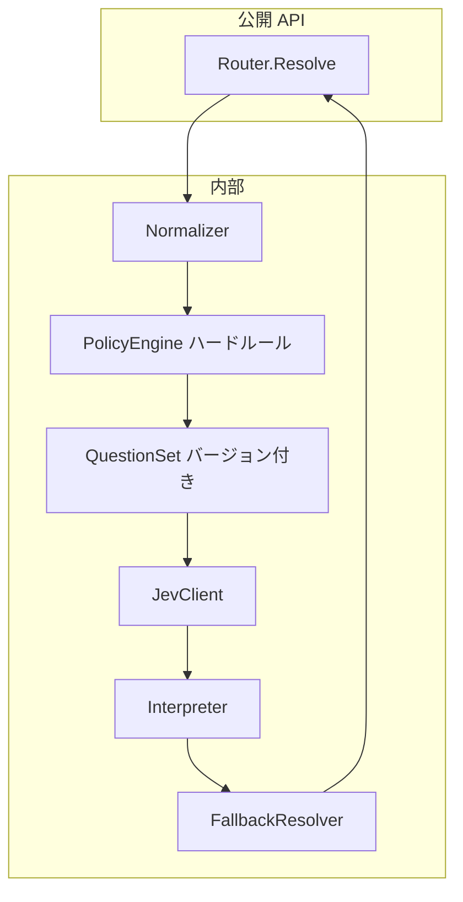

# アーキテクチャ

## 設計原則

1. **ライブラリファースト** — 単体バイナリや sidecar は後回し。`import` して使う。
2. **明示的な境界** — Jev に渡す payload は `RoutingContext` 型のみ。生 map を API 表面に出さない。
3. **決定論的レイヤ** — Jev の前後に **ハードポリシー**（セキュリティ必達ルール）を挟む。
4. **観測可能** — 各 Resolve で `plan_id`、質問別 confidence、フォールバック理由を返す。
5. **テスト容易** — `JevClient` インターフェースでモック差し替え。

---

## 論理コンポーネント



| コンポーネント | 役割 |
|----------------|------|
| **Normalizer** | ホスト入力を検証し、`RoutingContext` に正規化。未知フィールドは拒否または strip（方針は v0 で固定） |
| **PolicyEngine** | 法规・セキュリティの **must** ルール。Jev より優先（例: 再設定メール併送フラグ） |
| **QuestionSet** | テンプレートカテゴリごとに Jev 質問定義。semver でバージョン管理 |
| **JevClient** | System One 呼び出し（[jev-go](https://github.com/havlan/jev-go) 等をラップ） |
| **Interpreter** | `answers` → 中間 `RoutingDecision` |
| **FallbackResolver** | 低 confidence / API エラー時の静的プラン |

---

## ホストサービスとの統合

### 典型的な呼び出し位置

```text
HTTP/gRPC ハンドラ
  → ドメインイベント生成
  → notify-jev-router.Resolve   ← ここ
  → チャネル別ワーカーへ enqueue
```

### ホストが提供すべきもの

| データ | 例 | PII |
|--------|-----|-----|
| `template_id` | `security.new_login` | 否 |
| `category` | `security` / `billing` / `marketing` | 否 |
| `severity` | `critical` / `normal` / `low` | 否 |
| `locale` | `ja-JP` | 否 |
| `channels_enabled` | `{email: true, push: true}` | 否 |
| `device_summary` | `{count: 3, has_ios: true}` | 否（件数・種別のみ） |
| `has_recovery_email` | `true` | 否（有無のみ） |
| 本文・メールアドレス・IP | — | **Router に渡さない** |

配送時に必要な PII は、ホストが **RoutingPlan の宛先種別**（`primary_email`, `recovery_email`, `push_all` 等）に従い、別ストアから解決します。

---

## RoutingPlan（出力イメージ）

v0 では JSON 互換の構造体を想定。実装時に凍結します。

```go
// 概念型（未実装）
type RoutingPlan struct {
    PlanID      string
    Destinations []Destination
    Metadata    PlanMetadata // Jev model, question_set version, fallback used
}

type Destination struct {
    Channel   Channel // email | push | sms | in_app | webhook
    Target    TargetKind // primary | recovery | all_devices | last_active_device
    Priority  int
    Required  bool // PolicyEngine が must とした場合 true
}
```

---

## 設定

| 設定 | 説明 |
|------|------|
| `TYPESAFE_API_KEY` | Jev API（ホストまたはライブラリが読む） |
| `JEV_MODEL` | 本番は `jev-x.y.z` ピン推奨 |
| QuestionSet パス / embed | 組み込み FS またはホスト提供 |
| Confidence 閾値 | choice / noul ごとに設定可能 |

---

## エラーハンドリング

| 状況 | 挙動 |
|------|------|
| Jev 429/5xx | リトライ（SDK 任せ）→ 失敗時フォールバック |
| 低 confidence | カテゴリ別 **安全側** 静的プラン（例: security → email + recovery） |
| 不正入力 | `ErrInvalidContext`、Jev は呼ばない |
| Policy 衝突 | Policy が勝つ。Jev は補助 |

---

## 将来拡張（設計のみ）

- **QuestionSet のホットリロード**（ファイル watch）
- **OpenTelemetry** span（Jev レイテンシ、フォールバック率）
- **A/B**: 質問セットバージョンをフラグで切替
- **Sidecar / gRPC サービス** — 同一コアをラップ（マルチ言語向け）

実装順は [roadmap.md](roadmap.md) を参照。
