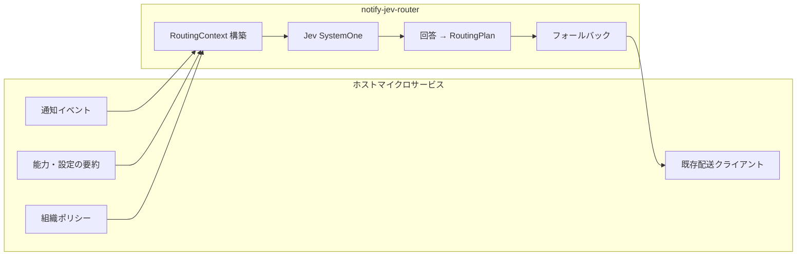

# 全体像：背景・目的・ゴール

## 背景

### 通知ルーティングが難しくなる理由

プロダクトが成長すると、通知は「テンプレート × チャネル」の表組みだけでは足りなくなります。

- **チャネルが増える** — メール、Push、SMS、アプリ内、Webhook など
- **ユーザー設定が複雑** — チャネル別 ON/OFF、静かな時間帯、マーケティング除外
- **アカウント安全系は例外** — ログイン通知は Push だけにしたいが、**再設定用メール**には必ず届けたい
- **Push の粒度** — 全デバイス、最終利用デバイスのみ、セッション単位など
- **同じテンプレートでも文脈で変わる** — 「支払い失敗」は請求系はメール必須、軽微なリマインドは Push のみ、など

これを **if/else や巨大な YAML だけ** で維持すると、

- ルールの意図がコードから読み取れない
- エッジケース追加のたびに退行が起きやすい
- 「なぜそのチャネルに送ったか」の説明が監査で困る

一方で、LLM に丸投げすると型がなく、本番で **再現性・テスト・閾値** が効きません。

### Jev を使う理由

[TypeSafe AI Jev](https://www.jevtypesafeai.com/)（System One API）は、**状態（state）と型付き質問（choice / noul / score 等）** に対し、**確率付きの構造化回答** を返します。

notify-jev-router ではこれを **「ルーティング政策の解決エンジン」** として使います。

- ビジネス側は「どんな判断をしたいか」を **質問と criteria** で表現
- 実装側は回答を **Go の型（RoutingPlan）** にマッピング
- 信頼度が低い場合は **決定的フォールバック**（静的ルールや人間レビュー）へ

個人情報（メールアドレス、氏名、本文の自由記述など）は **Jev の state に載せません**。ホストサービスが redact した **RoutingContext** のみを渡す設計とします（[constraints.md](constraints.md)）。

---

## 目的

1. **マイクロサービスに埋め込める** Go ライブラリとして、通知送信前の **宛先・チャネル・fan-out 方針** を一箇所で解決する
2. **Jev の型付き回答** をルーティング決定に変換し、閾値・フォールバック・テストをコードで扱えるようにする
3. **「なぜそうルートしたか」** を構造化ログ / メタデータとして残せるようにする（監査・デバッグ）
4. 設計と実装が mature になったら **OSS 公開** し、同種の問題を持つチームの参考実装にする

---

## ゴール

### 成功の定義（プロダクト内）

ホストの通知サービスが、送信前に次のような呼び出しをできること。

```text
RoutingPlan := router.Resolve(ctx, event, capabilities, policy)
// → 例: [email(primary), push(all_devices), email(recovery) 条件付き]
```

- **入力**: 通知イベントのメタデータ + ユーザー能力（チャネル利用可能か、デバイス数の要約など）+ 組織ポリシー
- **出力**: 実行可能な **RoutingPlan**（チャネル、宛先種別、fan-out、優先度、根拠メタデータ）
- **非機能**: レイテンシ予算内、Jev 障害時も安全側フォールバック、ユニットテスト可能

### 成功の定義（OSS 公開前チェックリスト）

| # | 条件 |
|---|------|
| 1 | 代表的なシナリオ（安全系メール、Push 全端末、再設定メール併送）が **テストと例** で示せる |
| 2 | PII が Jev に流れないことが **型 + ドキュメント + レビューガイド** で明示されている |
| 3 | `jev-latest` と **ピン留めモデル** の両方で再現性の方針が書かれている |
| 4 | モック Jev / 録画レスポンスで CI が回る |
| 5 | ライセンス・セキュリティ連絡先・最低限の CONTRIBUTING が揃っている |

### 非ゴール（v1 ではやらない）

- メール / Push の **実配送**（SMTP、FCM 等）— ホストが担当
- 通知 **本文の生成** や **テンプレートレンダリング**
- ユーザー向け **通知センター UI**
- 全社統一の **単一 SaaS** としてのホスティング（ライブラリが主役）

---

## スコープ境界



| 責務 | 所有者 |
|------|--------|
| PII の保持・マスキング | ホスト |
| Jev 用 state の組み立て（非 PII のみ） | notify-jev-router + ホスト提供データ |
| ルーティング判断 | notify-jev-router（Jev + ポリシー） |
| 配送・リトライ・DLQ | ホスト |

---

## 想定ユースケース（例）

| シナリオ | 判断の例 |
|----------|----------|
| 新規ログイン検知 | Push は全デバイス、メールはユーザー設定 ON 時のみ、**再設定メールは常に**（アカウント安全） |
| パスワード変更完了 | メール必須 + Push 任意 |
| マーケティングキャンペーン | 明示オプトインのみ、静かな時間帯は遅延（遅延自体はホスト、ルート可否は本ライブラリ） |
| 請求失敗 | severity に応じメール必須、Push は noul で補助 |
| 開発者向け Webhook | choice で internal / customer-facing を分岐 |

詳細な質問設計の方向性は [routing-model.md](routing-model.md) を参照してください。

---

## 用語（短い辞書）

| 用語 | 意味 |
|------|------|
| **NotificationEvent** | テンプレート ID、カテゴリ、severity、locale 等（PII なし） |
| **Capabilities** | 利用可能チャネル、デバイス数要約、再設定メール有無など |
| **Policy** | 組織の強制ルール（例: セキュリティ系はメール必須） |
| **RoutingPlan** | 解決結果：配信先リスト + fan-out + 根拠 |
| **Confidence gate** | Jev 回答の確率が閾値未満ならフォールバック |

---

## 次のステップ

実装フェーズの順序は [roadmap.md](roadmap.md) に記載しています。設計レビューでは **routing-model** の質問セットと **constraints** の PII 境界を先に固めることを推奨します。
