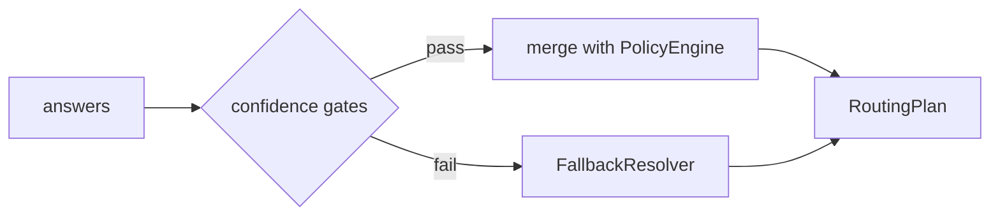

# ルーティング判断モデル

Jev へ「何を聞くか」と、回答を **RoutingPlan** にどう落とすかの設計メモです。実装前の **参照モデル** として扱い、QuestionSet の v0 草案になります。

---

## State（Jev に渡すコンテキスト）

1 リクエスト = 1 通知イベントのルーティング。state は **JSON オブジェクト** を推奨（テストしやすい）。

```json
{
  "template_id": "security.new_login",
  "category": "security",
  "severity": "high",
  "locale": "ja-JP",
  "user_prefs": {
    "email_marketing": false,
    "push_enabled": true,
    "quiet_hours_active": false
  },
  "capabilities": {
    "email_verified": true,
    "push_device_count": 3,
    "has_recovery_email": true,
    "sms_available": false
  },
  "org_policy_hints": {
    "force_recovery_on_security": true
  }
}
```

**含めてはいけない例**: `email`, `phone`, `ip`, `message_body`, `user_name`, `device_tokens`

---

## 質問セット（v0 草案）

1 回の `SystemOne` で **バッチ質問** し、レイテンシと token コストを抑えます。

### 1. 主チャネル（choice）

| criteria key | 意味 |
|--------------|------|
| `email_only` | メールのみで足りる |
| `push_only` | Push のみで足りる |
| `email_and_push` | 両方 |
| `in_app_only` | アプリ内のみ |
| `none_user_disabled` | ユーザー設定ですべて OFF（配送スキップ候補） |

instructions 例: 「この通知の重要度とカテゴリを踏まえ、ユーザーに届ける **主** チャネル戦略を選ぶ」

### 2. 再設定メール併送（noul）

「アカウント安全系として、**再設定用メールアドレス** にも送るべきか」

- 閾値例: `noul > 0.65` で `Destination{Channel: email, Target: recovery}` を追加
- `org_policy_hints.force_recovery_on_security` が true かつ `category=security` なら **PolicyEngine が先に must**（Jev は監査用に仍呼ぶか、スキップするかは実装時選択）

### 3. Push fan-out（choice）

| criteria key | 意味 |
|--------------|------|
| `all_devices` | 登録全デバイス |
| `last_active_only` | 最終アクティブのみ |
| `none` | Push しない |

### 4. メール必達（noul）

「規制・請求・セキュリティ上、**primary メール** が必須か」

- `true` なら `Required: true` の email(primary) を Plan に含める

### 5. 配送延期（noul）— オプション

静かな時間帯など。**ルートはするが deliver_at を future に** するのはホスト責務。本ライブラリは `DeferHint` メタデータのみ返す案。

---

## 解釈パイプライン



### confidence gate（初期案）

| 回答型 | ゲート |
|--------|--------|
| `choice` | `confidence >= 0.55` かつトップと 2 位の差 >= 0.15 |
| `noul` | 閾値は質問ごとに設定（recovery: 0.65 等） |

ゲート不合格の質問だけフォールバック表から埋める **部分フォールバック** も可。

---

## フォールバック表（カテゴリ × severity）

Jev 不可時の **安全側** デフォルト（例）。

| category | severity | デフォルト Plan |
|----------|----------|-----------------|
| security | any | email(primary) + email(recovery) + push(all_devices) |
| billing | high | email(primary) required + push(last_active) |
| billing | normal | email(primary) |
| marketing | any | ユーザー prefs が ON のチャネルのみ、それ以外は skip |
| transactional | normal | email(primary) + push(all_devices) |

表は YAML / embed でホストが上書き可能にする想定。

---

## テンプレートと QuestionSet の関係

| 方式 | メリット | デメリット |
|------|----------|------------|
| **カテゴリ単位** の QuestionSet | 質問数が少ない | テンプレート固有の nuance が弱い |
| **テンプレート ID マップ** | 精密 | メンテコスト |

**v0 推奨**: `category` ベース + 少数の `template_id` オーバーライド。

---

## 例：新規ログイン

**入力**: `security.new_login`, push 3 台, recovery あり, push ON

**Jev 回答（例）**:

- `primary_strategy.choice` = `email_and_push`
- `recovery_copy.noul` = 0.91
- `push_fanout.choice` = `all_devices`

**Plan**:

1. email → primary (required: policy)
2. email → recovery (required: noul + policy)
3. push → all_devices

**Metadata**: question_set=v0.1.0, model=jev-1.x.x, no fallback

---

## ホストへの返却情報（監査）

`PlanMetadata` に含めたい項目:

- `question_set_version`
- `jev_model`
- `answers_snapshot`（PII なし、確率のみ）
- `fallback_questions[]`
- `policy_overrides[]`（どの must ルールが効いたか）

---

## 設計判断（ADR で確定）

| テーマ | 決定 | ADR |
|--------|------|-----|
| 低 confidence 時 | 質問単位の部分フォールバック | [002](decisions/002-partial-fallback-on-low-confidence.md) |
| security で Jev をスキップするか | スキップしない（Policy + Jev） | [003](decisions/003-security-jev-not-skipped.md) |
| marketing | v0.1.0 はスコープ外（静的 prefs） | [004](decisions/004-marketing-out-of-scope.md) |
